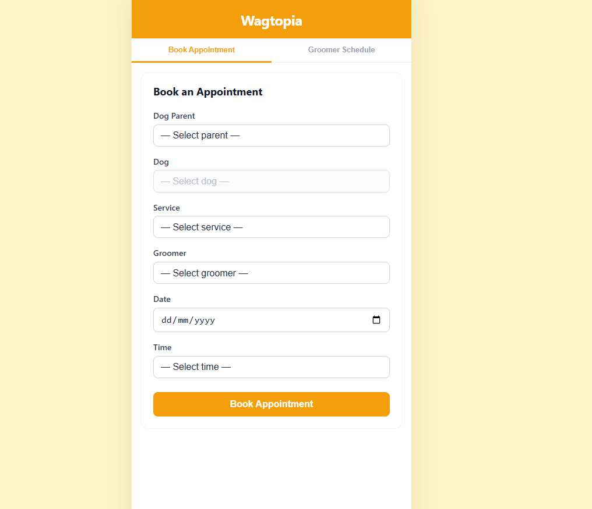
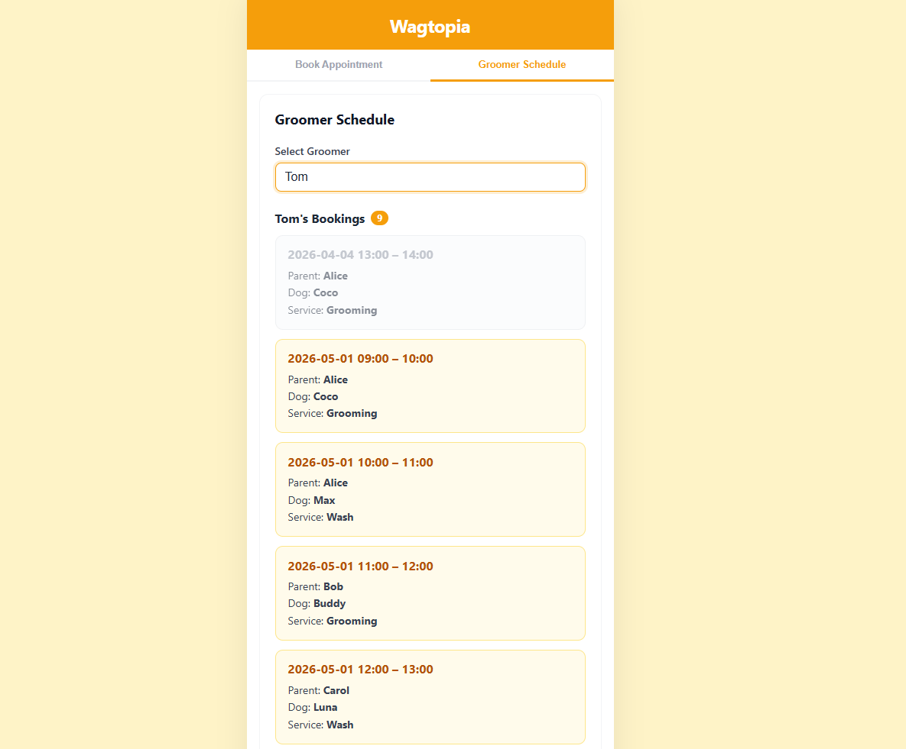

# Wagtopia – Dog Grooming Booking App

A mobile-friendly web application for booking dog grooming appointments.

## Prerequisites

- Python 3.10+
- Node.js 18+ (recommended: Node 20)

If you use `nvm`:
```bash
cd frontend && nvm install && nvm use
```

## Stack

| Layer    | Tech                     |
|----------|--------------------------|
| Frontend | React 18 + Vite          |
| Backend  | Python FastAPI + Uvicorn |
| Database | SQLite (auto-created)    |

---

## Project Structure

```
wagtopia/
├── Makefile
├── screenshots/
│   ├── parentbooking.png
│   └── groomerbooking.png
├── backend/
│   ├── app/
│   │   ├── main.py        # FastAPI app + all API routes
│   │   ├── database.py    # SQLite init, schema creation, seed data
│   │   └── models.py      # Pydantic request/response models
│   ├── schema.sql         # Standalone SQL schema + seed statements
│   └── requirements.txt
└── frontend/
    └── src/
        ├── App.jsx              # Root component with tab navigation
        ├── index.css            # Mobile-first styles
        └── pages/
            ├── BookingPage.jsx  # Dog parent booking form
            └── GroomerPage.jsx  # Groomer schedule view
```

---

## Running the App

### Quick start (recommended)

```bash
make install   # first time only — sets up Python venv + npm packages
make dev       # starts both servers; Ctrl+C stops both
```

Open **http://localhost:5173** in your browser.  
For mobile testing, use your machine's LAN IP (e.g., `http://192.168.x.x:5173`).

### Makefile targets

| Target            | Description                              |
|-------------------|------------------------------------------|
| `make install`    | Install all backend + frontend deps      |
| `make dev`        | Run both servers together                |
| `make backend`    | Run backend only (port 8000)             |
| `make frontend`   | Run frontend only (port 5173)            |
| `make clean`      | Remove DB, `.venv`, and `node_modules`   |

### Manual setup (without Make)

**Backend**
```bash
cd backend
python -m venv .venv
source .venv/bin/activate      # Windows: .venv\Scripts\activate
pip install -r requirements.txt
uvicorn app.main:app --reload --host 0.0.0.0 --port 8000
```

**Frontend**
```bash
cd frontend
npm install
npm run dev
```

The SQLite database (`wagtopia.db`) is created automatically on first start, with all tables and seed data loaded.

To override the API URL:
```bash
VITE_API_URL=http://localhost:8000 npm run dev
```

---

## API Endpoints

| Method | Path                          | Description                     |
|--------|-------------------------------|---------------------------------|
| GET    | `/api/health`                 | Health check                    |
| GET    | `/api/parents`                | List all parents                |
| GET    | `/api/parents/{id}/dogs`      | List dogs belonging to a parent |
| GET    | `/api/groomers`               | List all groomers               |
| GET    | `/api/groomers/{id}/bookings` | List bookings for a groomer     |
| GET    | `/api/services`               | List all services               |
| POST   | `/api/bookings`               | Create a new booking            |

### POST /api/bookings – Request body

```json
{
  "parent_id": 1,
  "dog_id": 1,
  "service_id": 2,
  "groomer_id": 1,
  "start_time": "2026-03-20 10:00"
}
```

Returns `409 Conflict` if the groomer has an overlapping booking, or `422` if the time slot is outside business hours (09:00–16:00) or not on the hour.

---

## Business Rules

- Every appointment lasts exactly **1 hour**.
- Groomer working hours are **09:00 – 17:00** (9 am to 5 pm).
- Appointments can only be booked on the hour: 09:00, 10:00, 11:00, …, 16:00 (last slot ends at 17:00).
- When booking for today, past time slots are hidden from the dropdown (e.g. at 1:23 pm, only 14:00 onwards is shown).
- When a groomer and date are selected, already-booked slots appear as **"HH:MM — Unavailable"** and cannot be selected, preventing overlapping bookings from the UI.
- The backend also enforces no overlapping bookings as a safeguard for direct API calls, returning `409 Conflict` if a conflict is detected.
- In the groomer schedule, past bookings (where the end time has passed) are displayed greyed out.
- The dog dropdown is disabled until a parent is selected; dogs are loaded dynamically based on the selected parent.

---

## Seed Data

Auto-loaded on first startup:

**Parents:** Alice, Bob, Carol

| Dog   | Breed    | Parent |
|-------|----------|--------|
| Coco  | Poodle   | Alice  |
| Max   | Labrador | Alice  |
| Buddy | Beagle   | Bob    |
| Luna  | Shih Tzu | Carol  |

**Groomers:** Mia, Tom, Sarah  
**Services:** Wash (60 min), Grooming (60 min)

**Pre-loaded bookings:**

| Groomer | Date       | Time  | Parent | Dog   | Service  |
|---------|------------|-------|--------|-------|----------|
| Mia     | 2026-04-01 | 10:00 | Alice  | Coco  | Grooming |
| Tom     | 2026-04-04 | 13:00 | Alice  | Coco  | Grooming |
| Tom     | 2026-05-01 | 09:00 | Alice  | Coco  | Grooming |
| Tom     | 2026-05-01 | 10:00 | Alice  | Max   | Wash     |
| Tom     | 2026-05-01 | 11:00 | Bob    | Buddy | Grooming |
| Tom     | 2026-05-01 | 12:00 | Carol  | Luna  | Wash     |
| Tom     | 2026-05-01 | 13:00 | Alice  | Coco  | Grooming |
| Tom     | 2026-05-01 | 14:00 | Bob    | Buddy | Wash     |
| Tom     | 2026-05-01 | 15:00 | Carol  | Luna  | Grooming |
| Tom     | 2026-05-01 | 16:00 | Alice  | Max   | Wash     |

---

## Screenshots




